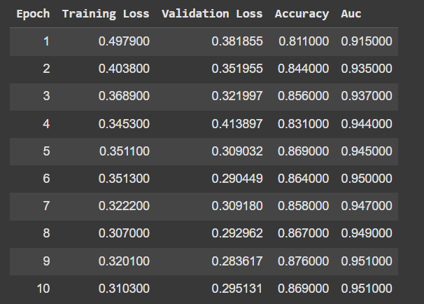

# Fine-Tuning BERT with LoRA for Text Classification

This project focuses on identifying phishing URLs using a fine-tuned BERT model with **Low-Rank Adaptation (LoRA)**. The model is trained on a dataset of URLs labeled as either phishing or not-phishing. The project is implemented in Python using the Hugging Face `transformers` library and is designed to run in Google Colab.

## Table of Contents
- [Overview](#overview)
- [Installation](#installation)
- [Usage](#usage)
  - [Training the Model](#training-the-model)
  - [Inference](#inference)
- [Saving and Loading the Model](#saving-and-loading-the-model)
- [Results](#results)


## Overview
Phishing attacks are a significant threat to online security. This project leverages the power of **BERT**, a state-of-the-art transformer model, fine-tuned with **LoRA** for efficient adaptation to the task of phishing URL identification. The model is trained on a labeled dataset of URLs and can classify new URLs as either phishing or legitimate.

*Benefits of LoRA: LoRA reduces the number of trainable parameters, making fine-tuning faster and more memory-efficient while maintaining performance.*

## Installation
To run this project, you need to install the following dependencies:

```bash
pip install transformers datasets torch peft evaluate numpy hugginface_hub
```

## Usage

### Training the Model
1. **Prepare the Dataset**: Ensure your dataset is in the correct format (e.g., a CSV file with `url` and `label` columns).
2. **Tokenize the Data**: Use the Hugging Face tokenizer to preprocess the URLs.
3. **Fine-Tune the Model**: Run the training script to fine-tune the BERT model with LoRA.

```python
from transformers import Trainer, TrainingArguments

# Define training arguments
training_args = TrainingArguments(
    output_dir="bert-phishing-classifier",
    learning_rate=lr,
    per_device_train_batch_size=batch_size,
    per_device_eval_batch_size=batch_size,
    num_train_epochs=num_epochs,
    logging_strategy="epoch",
    eval_strategy="epoch",
    save_strategy="epoch",
    load_best_model_at_end=True,
    report_to="none",
)

# Initialize the Trainer
trainer = Trainer(
    model=model,
    args=training_args,
    train_dataset=tokenized_data["train"],
    eval_dataset=tokenized_data["test"],
    tokenizer=tokenizer,
    data_collator=data_collator,
    compute_metrics=compute_metrics,
)

# Train the model
trainer.train()
```

### Inference
To classify a new URL, load the fine-tuned model and tokenizer, then pass the URL through the model:

```python
import torch
from transformers import AutoModelForSequenceClassification, AutoTokenizer

# Load the model and tokenizer
model = AutoModelForSequenceClassification.from_pretrained("/path/to/saved/model")
tokenizer = AutoTokenizer.from_pretrained("/path/to/saved/tokenizer")

# Example URL
url = "http://example.com"

# Tokenize the URL
inputs = tokenizer(url, return_tensors="pt", truncation=True, padding=True)

# Make prediction
with torch.no_grad():
    logits = model(**inputs).logits

# Convert logits to probabilities
probs = torch.softmax(logits, dim=-1)

# Get the predicted class
predicted_class = torch.argmax(probs, dim=-1).item()

# Map the predicted class to a label
label = "Phishing" if predicted_class == 1 else "Legitimate"
print(f"The URL is classified as: {label}")
```

## Saving and Loading the Model
### Save the Model and Tokenizer
After training, save the model and tokenizer to a directory:

```python
model.save_pretrained("/path/to/save/model")
tokenizer.save_pretrained("/path/to/save/tokenizer")
```

### Load the Model and Tokenizer
To load the model and tokenizer for inference:

```python
model = AutoModelForSequenceClassification.from_pretrained("/path/to/saved/model")
tokenizer = AutoTokenizer.from_pretrained("/path/to/saved/tokenizer")
```

## Results


---
### The model achieves the following performance on the validation dataset:
- **Accuracy**: 0.884
- **AUC**: 0.946
